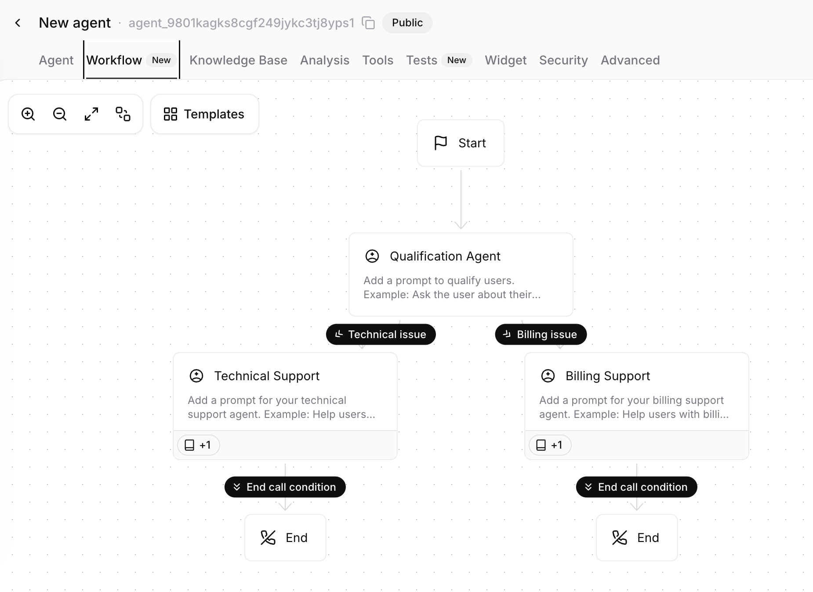

# Building Your Voice Agent - Conversational AI in Action
## Individual Activity

### Overview
Create an interactive voice agent that can answer questions, guide conversations, and provide information using ElevenLabs.io's free voice agent platform. You'll build a knowledge base, design conversation flows, and test your agent - all without writing code.

**AI Efficiency Principle**: If you find yourself doing something repetitively over time, ask yourself: "How can I do this faster with AI?" If you don't know the answer, ask AI: "How can I do this faster with AI?" This lab is about using AI tools effectively, so don't hesitate to use AI to streamline your workflow.

**Important Note About This Lab**: This lab intentionally does not provide step-by-step instructions because AI tools and their interfaces change frequently (often weekly). Instead, you'll explore the ElevenLabs platform and use AI assistants (like ChatGPT or Claude) to help you understand the interface. If you're stuck on how to do something, take a screenshot of the interface and ask an AI: "How do I [what you want to do] in this ElevenLabs interface?" or "What does this button/section do in ElevenLabs?" This approach teaches you to adapt to changing tools - a critical skill in the AI era.

**Time Estimate**: 45-60 minutes

### Tools Required (All Free & Working)
- **[ElevenLabs.io](https://elevenlabs.io)** - Voice agent platform (free account)
- **3-4 knowledge sources** - Articles, links, or websites (totaling approximately 3-4 KB of content)
- **ChatGPT or Claude** - To help you understand the interface and troubleshoot
- **Web browser** - Chrome, Firefox, or Safari

---

## Part 1: Setup & Knowledge Base (15-20 min)

### Getting Started
1. **Create Your Account**:
   - Go to [ElevenLabs.io](https://elevenlabs.io) and sign up for a free account
   - Navigate to the Voice Agent or Conversational AI section in the dashboard
   - Look for options to create a new agent

2. **Create Your Agent**:
   - Start with a blank template or basic template
   - Give your agent a name and purpose (e.g., "Campus Info Assistant" or "Product Support Bot")
   - Set an initial greeting message that introduces your agent

### Building Your Knowledge Base
Your agent needs information to answer questions. You'll add 3-4 knowledge sources that total approximately 3-4 KB of content.

**What makes good knowledge base content?**
- Clear, factual information
- Topics that relate to each other (so the agent can have coherent conversations)
- Content that answers common questions
- Examples: FAQ pages, product documentation, event information, service descriptions, policy pages

**How to add knowledge:**
- Look for a "Knowledge Base" or "Add Content" section in your agent settings
- You can typically add:
  - **URLs/links** - Paste website URLs (the agent will read the content)
  - **Text/articles** - Copy and paste text content directly
  - **Files** - Upload documents if supported
- Add 3-4 different sources that work together to create a useful knowledge base

**💡 AI Efficiency Tip**: If you're struggling to find good content, ask ChatGPT or Claude: "Give me 3-4 short articles or topics (about 1 KB each) that would work well for a voice agent knowledge base about [your topic]." Then use those topics to find real content or create your own.

---

## Part 2: Conversation Design (20-25 min)

### Designing Conversation Branches
Your agent needs at least **3 distinct conversation branches** - different paths users can take based on what they ask or need.

**Example Workflow**: Here's an example of how a conversation workflow with multiple branches might look:

**What are conversation branches?**
Think of branches as different conversation flows. For example:
- **Branch 1**: General information lookup ("Tell me about...")
- **Branch 2**: Specific problem-solving ("How do I...")
- **Branch 3**: FAQ or common questions ("What is...")
- **Branch 4**: Product/service categories ("I need help with...")

**How to design branches:**
- Consider what users might ask your agent
- Think about different user intents (information, help, troubleshooting, etc.)
- Design how your agent should respond to guide users down different paths
- Use the agent's system prompt or conversation flow settings to define these branches

**Exploration is key**: The ElevenLabs interface may have different ways to set up conversation flows - explore the settings, prompts, and workflow options. You might find:
- System prompts that guide conversation direction
- Workflow editors or conversation tree builders
- Response templates or examples
- Settings for handling different types of queries

**💡 Design Tip**: Your branches don't need to be complex. Even simple distinctions like "product information," "technical support," and "general questions" count as three branches. The goal is to show your agent can handle different types of conversations.

---

## Part 3: Testing & Refinement (10-15 min)

### Testing Your Agent
1. **Find the Test Interface**:
   - Look for a "Test" or "Try It" button in your agent dashboard
   - You may be able to test via web interface, phone call, or both

2. **Run Test Conversations**:
   - Try asking questions that test each of your 3+ conversation branches
   - Ask questions that should pull information from your knowledge base
   - Test edge cases: What happens if you ask something not in the knowledge base?

3. **Observe and Refine**:
   - Does the agent respond appropriately to each branch type?
   - Are the responses accurate based on your knowledge base?
   - Does the conversation flow naturally?
   - Make adjustments to your system prompt, knowledge base, or conversation design as needed

**What to test:**
- At least one question from each conversation branch
- Questions that require knowledge base lookups
- General conversation flow and naturalness

---

## Deliverable

Submit a screenshot of your agent's workflow that shows your conversation branches/flow design. The screenshot should clearly show at least 3 distinct conversation branches in your agent's workflow interface.

---

---

## Reflection Questions (Optional)

Consider these questions as you work through the lab:

1. **Branch Design Challenge**: What was the most challenging part of designing the conversation branches? Did you discover anything about how voice agents handle different conversation paths?

2. **Knowledge Base Impact**: How did the knowledge base content you added affect the agent's responses? Did certain types of content work better than others?

3. **Real-World Application**: What real-world application could this voice agent have? Think about a specific industry, business, or use case where this type of agent would be valuable.

---

### The Bottom Line
You just built a working voice agent that can have conversations, access knowledge, and guide users through different conversation paths. This is the same technology powering customer service bots, virtual assistants, and interactive phone systems. Voice agents are becoming essential tools for businesses to provide 24/7 support and information access - and you built one in under an hour.

### Final Reflection
What surprised you most about how the voice agent handled conversations? Would you use a voice agent like this in your daily life, and if so, for what purpose?

